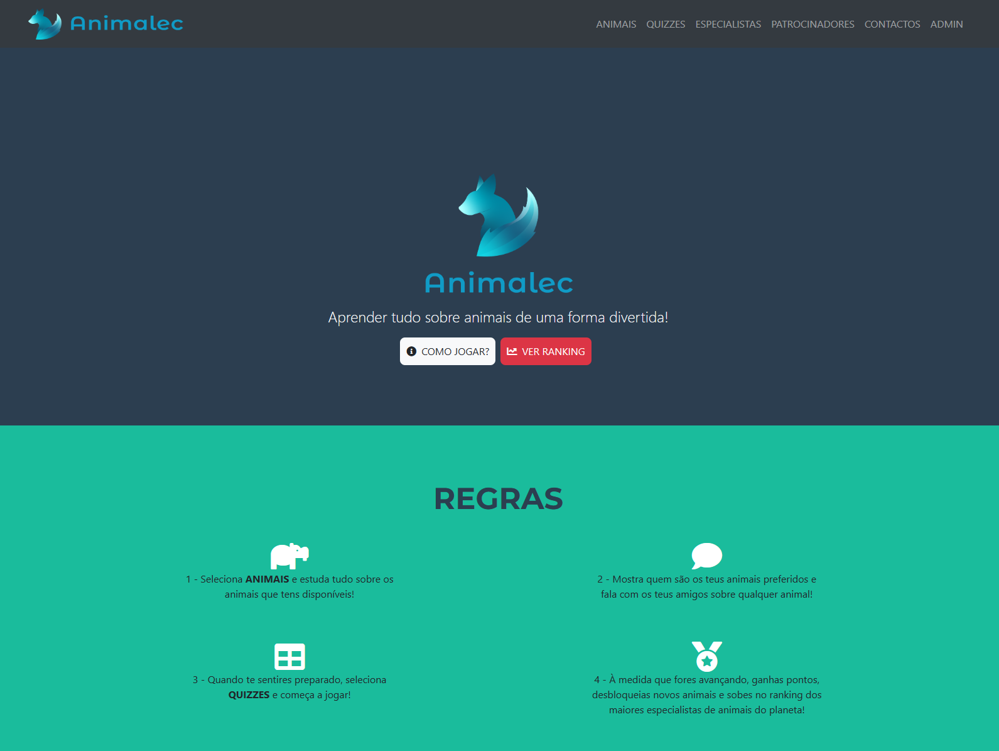
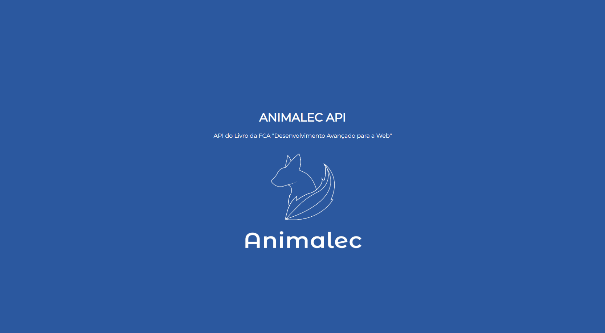

    

# MiniProj3
Tarefa 4.2: Mini-projeto - desenvolvimento do back-end

## Introdução

Este projeto foi criado no âmbito da UC de Programação Web Avançada (PWA). 

O trabalho tem como base o projeto Animalec apresentado no livro [DESENVOLVIMENTO AVANÇADO PARA A WEB - DO FRONT-END AO BACK-END" da FCA](https://www.fca.pt/pt/catalogo/informatica/tecnologias-programacao-web/desenvolvimento-avancado-para-a-web/).

O objectivo deste trabalho deriva de um trabalho anterior, onde foram adicionadas novas funcionalidades ao front-end, e tem como objectivo a integração com o back-end de forma a garantir que essas funcionalidades cumpram o seu proposito. As funcionalides anteriormente adicionadas foram duas areas de gestão, sendo que uma pertende possibilitar a gestão de Especialistas e a outra os Patrocinadores. 

## Fases da tarefa:

1. Cada aluno deve ler os recursos partilhados para consolidar os conhecimentos JavaScript, Node.js e Express, e compreender a estrutura do código partilhado. Para esta fase da tarefa ser considerada terminada, deverá ter o back-end de processamento de formulários esteja totalmente funcional baseado nas boas práticas nesta componente do full-stack.

2. Cada aluno deve implementar ao nível do back-end o tratamento de pedidos relativos às novas entidades desenvolvidas na tarefa 3.2, com todas as funcionalidades previstas. As entidades desenvolvidas são as seguintes: sponsors e experts.

3. Cada aluno deve explorar a aplicação Postman para validar os pedidos ao servidor.

4. Todos os ficheiros desenvolvidos devem ser submetidos na plataforma Git, na conta individual de cada aluno. O projeto no Git deve-se chamar de MiniProj3. A avaliação do projeto será realizada a partir dos ficheiros existentes no Git.

## Realização

Para realização deste trabalho foi usado como base o código desponibilizado com o Livro.

O resultado final pode ser feito através dos seguintes links:

- Link para o backend: https://animalec.onrender.com/

- Link para o frontend: https://animalec-fe.vercel.app/

Para fazer login como admin:

- username: root
- password: toor

Como o servidor de backend é "grátis" é preciso esperar um pouco até que ele fique novamente online. Para saber que esta online basta abrir pagina https://animalec.onrender.com/ e esperar que apareça a pagina do ANIMALEC API.

    

